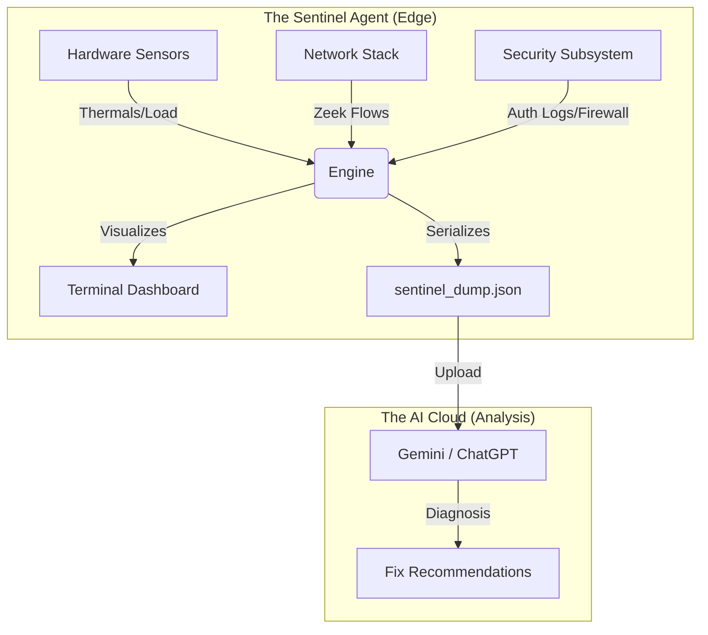

# Sentinel MaaS

### AI-Native MaaS Agent & Telemetry Dashboard

**Sentinel** is a high-fidelity, low-resource system monitor written in Go. Originally designed to "revive" older Intel-based MacBooks with passive cooling logic, it has evolved into a **Monitoring as a Service (MaaS)** agent.

It combines a real-time Terminal User Interface (TUI) for local debugging with a background "Agent" that serializes deep system telemetry (Network Flows, Security Logs, Thermal Health) into JSON for analysis by LLMs or cloud platforms.

---

## Architecture

Sentinel operates as a hybrid **Edge Agent**. It runs locally on the endpoint, collecting data from the kernel, visualizing it for the user, and preparing it for uplink.



---

## Features

### 1. MaaS Telemetry (The "Service")

* **Network Flows (Zeek-Lite)**: Tracks active connections in real-time, mapping `Source IP` → `Dest IP` and resolving the specific `Process Name` (e.g., `python3` talking to `142.250.x.x`).
* **Security Stream**: Live tailing of the `com.apple.securityd` subsystem to catch authentication events and keychain access.
* **Perimeter Check**: Monitors macOS Firewall status (`pf`) and active USB devices to detect physical tampering.

### 2. Hardware Revival (The "TUI")

* **Passive Thermal Logic**: Specialized for fanless MacBooks (like the 2017 Retina). Alerts with color-coded warnings (Yellow/Red) if CPU Die Temperature exceeds throttling thresholds (88°C+).
* **Dynamic Load Analysis**: Automatically detects core count (i5/i7/M1) to calculate accurate "Load Pressure," distinguishing between busy work and actual system lag.

### 3. AI-Native Diagnostics

* **The "Doctor"**: Press **d** to open the diagnostic overlay. It instantly evaluates system health and saves a snapshot.
* **JSON Export**: Generates `sentinel_dump.json` containing the exact state of the machine. Upload this to an AI agent to get specific debugging steps (e.g., *"Process X is causing disk thrashing"*).

---

## Installation

**Prerequisites:**

* macOS (Optimized for Ventura+, compatible with Intel & Silicon).
* **Root Privileges**: Required to access `powermetrics` (thermals), `log stream` (security), and `pfctl` (firewall).

### Option A: Build from Source (Recommended)

1. **Clone & Init:**
```bash
git clone https://github.com/yourusername/sentinel.git
cd sentinel
go mod init sentinel
go get github.com/gizak/termui/v3
go get github.com/shirou/gopsutil/v4

```


2. **Compile:**
*We use flags to strip debug info for a smaller, faster binary.*
```bash
go build -ldflags "-s -w" -o sentinel

```


3. **Install Globally:**
```bash
sudo mv sentinel /usr/local/bin/

```


---

## Usage Guide

Run Sentinel with `sudo` to enable full sensor access:

```bash
sudo sentinel

```

### Dashboard Controls

| Key | Function | Description |
| --- | --- | --- |
| **d** | **Doctor Mode** | Opens the diagnostic overlay AND creates the JSON snapshot. |
| **q** | **Quit** | Gracefully shuts down the agent and releases resources. |
| **Ctrl+C** | **Force Quit** | Immediate exit. |

### Interpreting the Interface

1. **Top Left (Sparkline):** CPU Activity. If the title says `Load: > 2.0` (on a dual-core), you are experiencing lag.
2. **Top Right (Thermals):**
* **Green:** Passive cooling is working (< 75°C).
* **Red:** System is throttling (> 88°C).


3. **Bottom Left (Flows):** Shows who is talking to the internet. Look for unknown process names connecting to public IPs.
4. **Bottom Right (Logs):** Real-time security events. Watch for rapid scrolling (brute force attempts).

---

## AI Troubleshooting Workflow

How to use Sentinel as a "MaaS" tool for debugging:

1. **The Symptom:** Your laptop feels slow or hot.
2. **The Capture:** Run `sudo sentinel` and press **d**.
3. **The Handoff:** Locate `sentinel_dump.json` in your folder.
4. **The Prompt:** Upload the file to Gemini/ChatGPT with the prompt:
> *"Act as a Site Reliability Engineer. Analyze this Sentinel telemetry snapshot. Identify the process causing the high load and verify if the network flows look suspicious."*


---

## Common Issues

* **Error:** `panic: interface conversion...`
* **Fix:** You are likely using an older version of the code. Ensure `ui.NewStyle` has 3 arguments: `(Color, Background, Modifier)`.


* **"Temp: ??"**:
* **Fix:** Your Mac model uses a different sensor name. Run `sudo powermetrics -n 1 --samplers thermal` to find your sensor name, then update the Regex in `main.go`.


* **"ERR: Need Sudo"**:
* **Fix:** Sentinel is a security tool; it needs root access to read the Kernel Firewall and Thermal Sensors. Always run with `sudo`.


---

## License

MIT License. Open source and ready for modification.